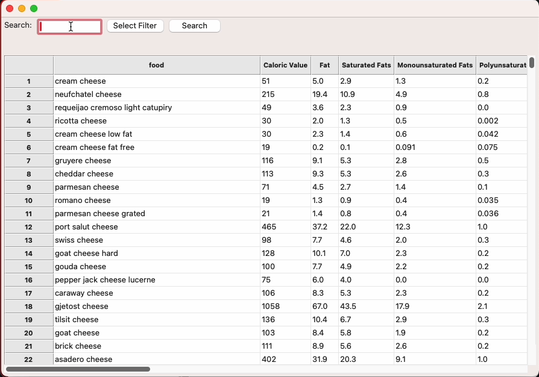
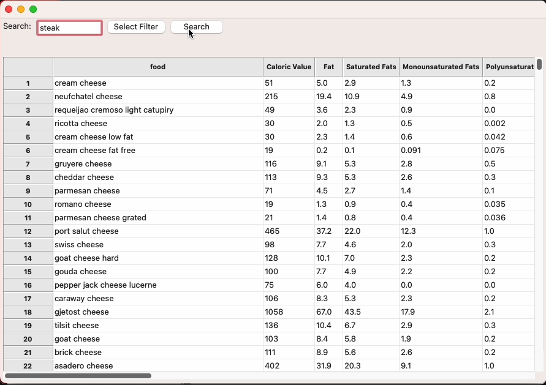
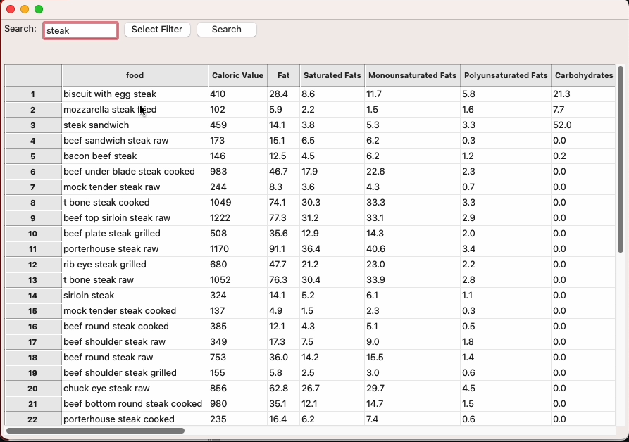
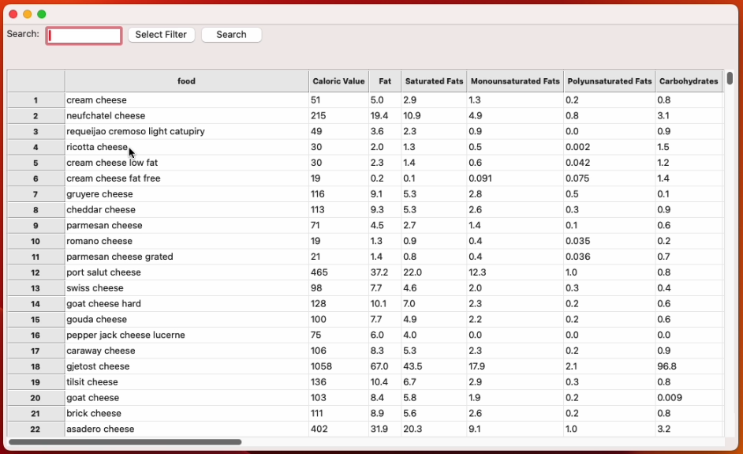
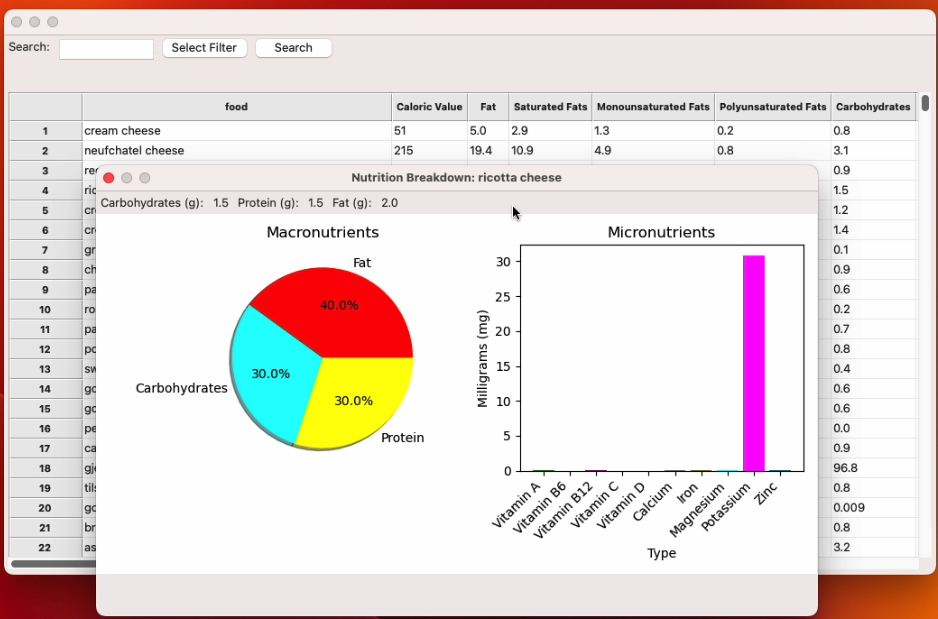

# Executive Summary

Please provide your GitHub repository link.
### GitHub Repository URL: https://github.com/Sean-O-99/SoftwareTechAssign

---

You should use your software to prepare an executive summary as outlined below for the five required features.

## 1. Food Search
### Description  
This feature allows the user to search the connected database for a food items based on an input string they enter.

### Steps
1. User clicks on the text box to the right of the "Search:"
2. The user enters their search phrase
3. The program will display related items based on that search

### Screenshots
Include screenshots for each step demonstrating the use of this feature. 
#### Step 1

#### Step 2

#### Step 3

---

## 2. Nutrition Breakdown
### Description  
This feature allows the user to see a more detailed and visual display of their selected food items nutrition.

### Steps
1. User clicks on a food item they want to inspect
2. The program displays the selected items most important macro and micronutrient values

### Screenshots
Include screenshots for each step demonstrating the use of this feature.
#### Step 1

#### Step 2

---

## 3. [Feature 3 Name]
### Description  
Briefly describe what this feature does.

### Steps
1. Step-by-step instructions for using this feature.
2. Add additional steps as needed.

### Screenshots
Include screenshots for each step demonstrating the use of this feature.    

---

## 4. [Feature 4 Name]
### Description  
Briefly describe what this feature does.

### Steps
1. Step-by-step instructions for using this feature.
2. Add additional steps as needed.

### Screenshots
Include screenshots for each step demonstrating the use of this feature.    

---

## 5. [Feature 5 Name]
### Description  
Briefly describe what this feature does.

### Steps
1. Step-by-step instructions for using this feature.
2. Add additional steps as needed.

### Screenshots
Include screenshots for each step demonstrating the use of this feature.    

---
