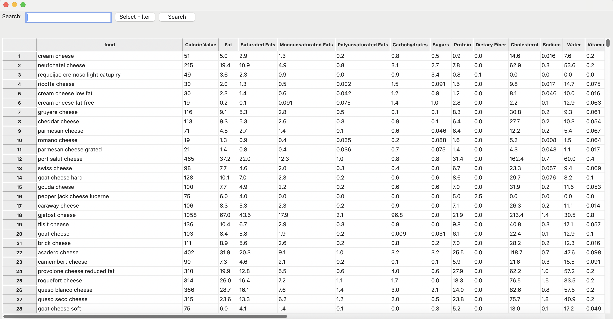
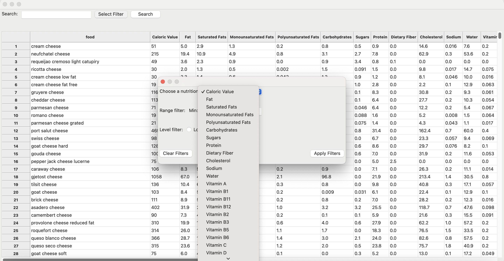
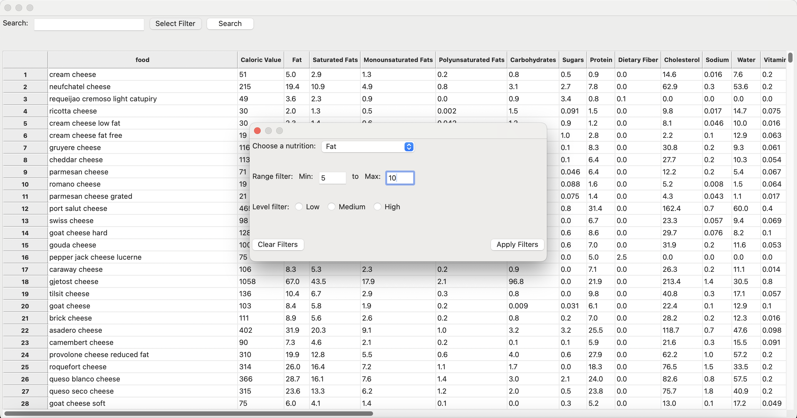
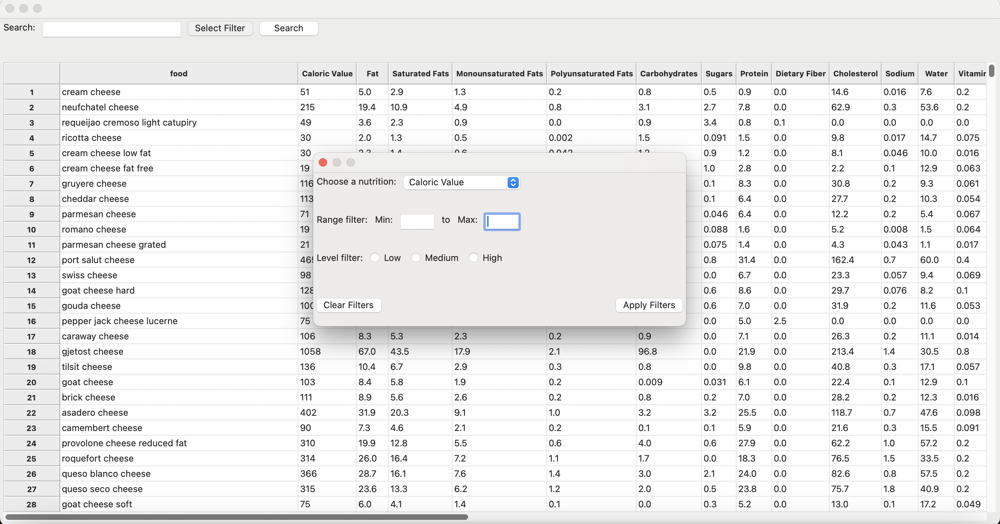
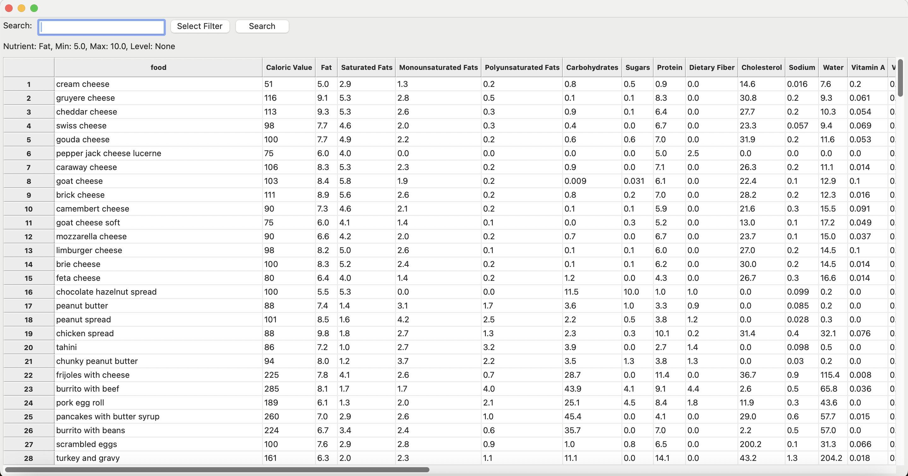
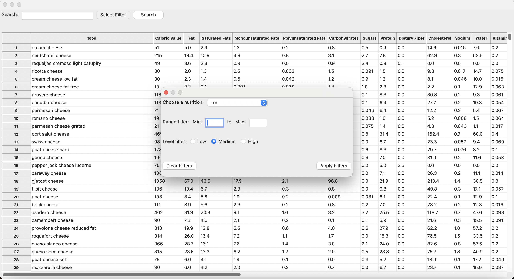
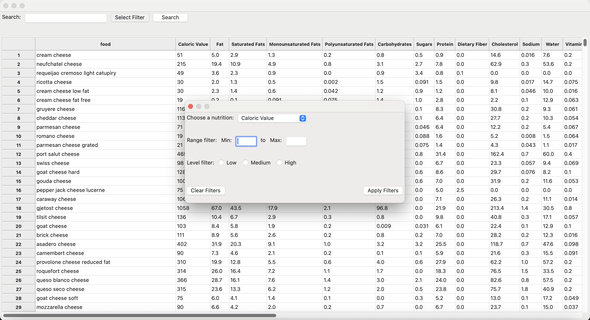
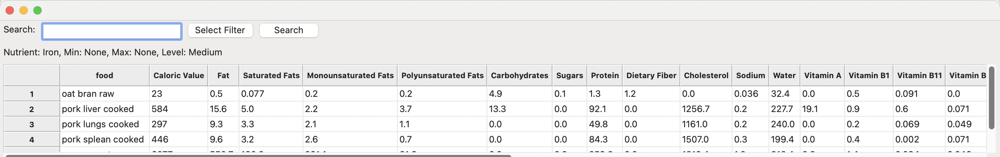

# Executive Summary

Please provide your GitHub repository link.
### GitHub Repository URL: https://github.com/XXXX/XXXXX.git

---

You should use your software to prepare an executive summary as outlined below for the five required features.

## 1. [Feature 1 Name]
### Description  
Briefly describe what this feature does.

### Steps
1. Step-by-step instructions for using this feature.
2. Add additional steps as needed.

### Screenshots
Include screenshots for each step demonstrating the use of this feature.  

---

## 2. [Feature 2 Name]
### Description  
Briefly describe what this feature does.

### Steps
1. Step-by-step instructions for using this feature.
2. Add additional steps as needed.

### Screenshots
Include screenshots for each step demonstrating the use of this feature.  

---

## 3. Nutrition Range Filter
### Description  
This feature allows users to filter food items based on specific nutritional criteria like calorie count, fat content, carbohydrates, etc. This features helps users find foods that meet their dietary needs by allowing them to set minimum and maximum limits for the selected nutrient.

### Steps
1. To access this feature, users click on the 'Select Filter' button.
2. A pop-up window will appear and users are able to select a nutrient from a list to apply filters to.
3. Users can set their desired minimum and maximum values for the selected nutrient using input fields.
4. After entering the values, users can click the 'Apply Filter' button to apply the chosen criteria.
5. If needed, users can clear the filter by clicking the 'Clear Filter' button, which will reset the criteria. 
6. The application will then refresh the table of food items, only showing the food items that fall within the specified nutritional range. The criteria specified will also be displayed above the table for reference.
7. Users can repeat the filtering process with different nutrients as desired.

### Screenshots
1. As seen in the screenshot below, access the 'Select Filter' button through the main page. 

2. Upon clicking 'Select Filter', a pop-up window will appear with a list of nutrients and different filter options.

3. Users can set their desired minimum and maximum values for the selected nutrient.

4. Users are able to 'Clear Filters' to reset the criteria.

5. When users click on 'Apply Filter', the table is refreshed and displays only food items that fit the criteria. The criteria is also displayed for reference.

---

## 4. Nutrition Level Filter
### Description  
This feature allows users to filter food items by nutritional content levels—low, mid, and high— across various nutrients such as fat, protein, etc. Users can easily identify foods that align with their dietary goals based on predefined thresholds for each nutrient level.

### Steps
1. To access this feature, users click on the 'Select Filter' button.
2. A pop-up window will appear and users are able to select a nutrient from a list to apply filters to.
3. Users can choose their desired nutritional content level:
   - **Low:** Select this option to filter foods with lower nutrient content.
   - **Mid:** Select this option for foods with moderate nutrient levels.
   - **High:** Choose this option for foods with higher nutrient content.
4. After making their selection, users can click the 'Apply Filter' button to filter the food items accordingly. 
5. If needed, users can clear the filter by clicking the 'Clear Filter' button, which will reset the criteria.
6. The application will then refresh the table of food items, only showing the food items that fall within the specified nutritional range. The criteria specified will also be displayed above the table for reference.
7. Users can repeat the filtering process with different nutrients as desired.

### Screenshots
1. As seen in the screenshot below, access the 'Select Filter' button through the main page.

2. Upon clicking 'Select Filter', a pop-up window will appear with a list of nutrients and different filter options.

3. Users can set their desired nutritional content level.

4. If needed, users can 'Clear Filters' to reset the criteria.

5. Upon clicking 'Apply Filters', users are shown the a table of food items that fit the criteria chosen. The criteria is also displayed for reference.

---

## 5. [Feature 5 Name]
### Description  
Briefly describe what this feature does.

### Steps
1. Step-by-step instructions for using this feature.
2. Add additional steps as needed.

### Screenshots
Include screenshots for each step demonstrating the use of this feature.    

---
