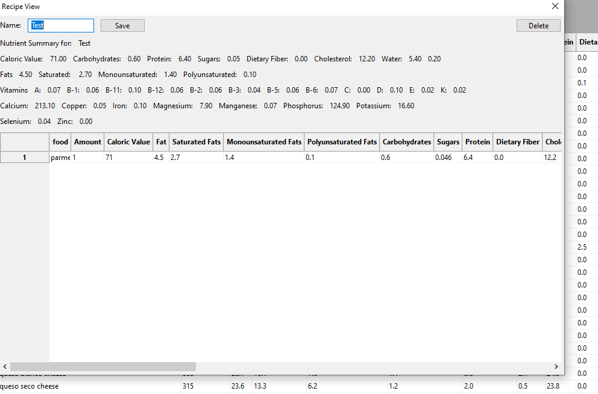
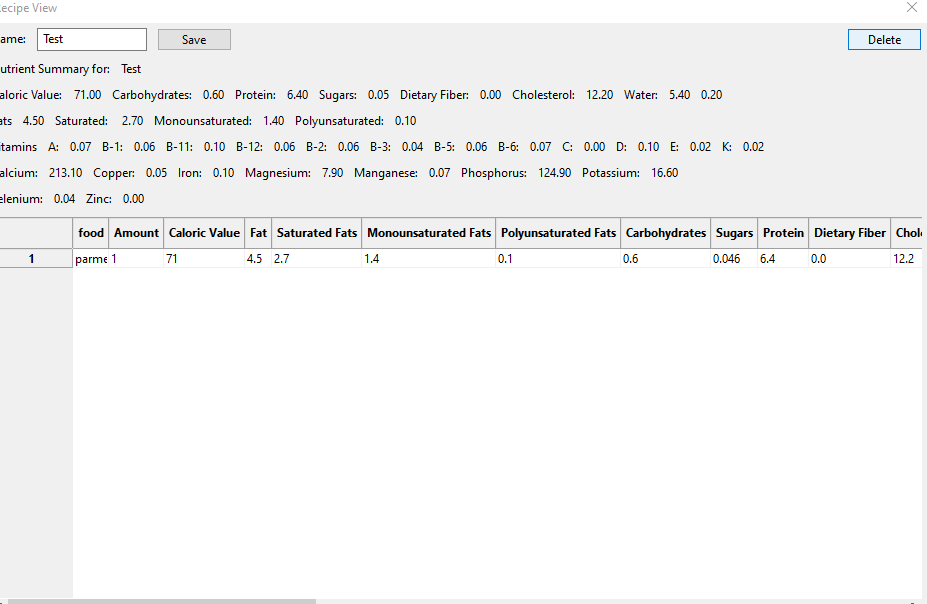

# Executive Summary

Please provide your GitHub repository link.
### GitHub Repository URL: https://github.com/Sean-O-99/SoftwareTechAssign

---

You should use your software to prepare an executive summary as outlined below for the five required features.

## 1. Food Search
### Description  
This feature allows users to search the connected database for food items based on an input string they enter. This will help users to find out more about the nutritional information of their food.

### Steps
1. User clicks on the text box to the right of the "Search:".
2. The user enters their search phrase.
3. The program will display certain items based on that search.
4. The user can enter a new search term at any time.

### Screenshots
Include screenshots for each step demonstrating the use of this feature. 
#### Step 1

#### Step 2

#### Step 3

---

## 2. Nutrition Breakdown
### Description  
This feature allows users to see a more detailed and visual display of their selected food items nutrition. This will help the users to visualise the nutritional makeup of their food and understand its composition.

### Steps
1. User clicks on the cell of a food item they want to inspect.
2. The program displays the selected items most important macro and micronutrient values.
3. The user clicks the exit button on the top left of the window to exit the view

### Screenshots
Include screenshots for each step demonstrating the use of this feature.  

#### Step 1

#### Step 2

#### Step 3

---

## 3. Nutrition Range Filter
### Description  
This feature allows users to filter food items based on specific nutritional criteria like calorie count, fat content, carbohydrates, etc. This features helps users find foods that meet their dietary needs by allowing them to set minimum and maximum limits for the selected nutrient.

### Steps
1. To access this feature, users click on the 'Select Filter' button.
2. A pop-up window will appear and users are able to select a nutrient from a list to apply filters to.
3. Users can set their desired minimum and maximum values for the selected nutrient using input fields.
4. After entering the values, users can click the 'Apply Filter' button to apply the chosen criteria.
5. If needed, users can clear the filter by clicking the 'Clear Filter' button, which will reset the criteria. 
6. The application will then refresh the table of food items, only showing the food items that fall within the specified nutritional range. The criteria specified will also be displayed above the table for reference.
7. Users can repeat the filtering process with different nutrients as desired.

### Screenshots
1. As seen in the screenshot below, access the 'Select Filter' button through the main page. 

2. Upon clicking 'Select Filter', a pop-up window will appear with a list of nutrients and different filter options.

3. Users can set their desired minimum and maximum values for the selected nutrient.

4. Users are able to 'Clear Filters' to reset the criteria.

5. When users click on 'Apply Filter', the table is refreshed and displays only food items that fit the criteria. The criteria is also displayed for reference.

---

## 4. Nutrition Level Filter
### Description  
This feature allows users to filter food items by nutritional content levels—low, mid, and high— across various nutrients such as fat, protein, etc. Users can easily identify foods that align with their dietary goals based on predefined thresholds for each nutrient level.

### Steps
1. To access this feature, users click on the 'Select Filter' button.
2. A pop-up window will appear and users are able to select a nutrient from a list to apply filters to.
3. Users can choose their desired nutritional content level:
   - **Low:** Select this option to filter foods with lower nutrient content.
   - **Mid:** Select this option for foods with moderate nutrient levels.
   - **High:** Choose this option for foods with higher nutrient content.
4. After making their selection, users can click the 'Apply Filter' button to filter the food items accordingly. 
5. If needed, users can clear the filter by clicking the 'Clear Filter' button, which will reset the criteria.
6. The application will then refresh the table of food items, only showing the food items that fall within the specified nutritional range. The criteria specified will also be displayed above the table for reference.
7. Users can repeat the filtering process with different nutrients as desired.

### Screenshots
1. As seen in the screenshot below, access the 'Select Filter' button through the main page.

2. Upon clicking 'Select Filter', a pop-up window will appear with a list of nutrients and different filter options.

3. Users can set their desired nutritional content level.

4. If needed, users can 'Clear Filters' to reset the criteria.

5. Upon clicking 'Apply Filters', users are shown the a table of food items that fit the criteria chosen. The criteria is also displayed for reference.

---

## 5. [Recipe Builder]
### Description  
Builds a recipe by adding items from the main display table and then totals the nutrients of the items in the list. Allowing the user to evaluate the nutrients
of a select few items.

### Steps
1. User can click New Recipe to begin creating a new recipe item. User Selects a name and saves the recipe.

2. User can right click an item in the table to bring up a menu and choose to add an item to the current recipe.

3. User clicks the view recipe button when they have finished adding items to the recipe.

4. Once in the recipe builder view the user can observe the total nutrients of their accumulated items

5. User can choose to remove an item from the recipe by right clicking it in the table and selecting remove item.

6. User can choose to increase the amount of a selected item to match the amount of serves in their desired recipe.

7. User can rename their recipe and press save. It will save any changes to the list as well as name changes and move back to the main view.

8. User can choose to delete their recipe clearing any items and moving the user back to the main view.

---
