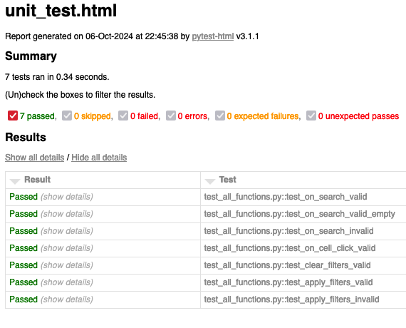

# Unit Testing Report

Please provide your GitHub repository link.
### GitHub Repository URL: https://github.com/Sean-O-99/SoftwareTechAssign

---

The testing report should focus solely on <span style="color:red"> testing all the self-defined functions related to 
the five required features.</span> There is no need to test the GUI components. Therefore, it is essential to decouple your code and separate the logic from the GUI-related code.


## 1. **Test Summary**
list all tested functions related to the five required features and the corresponding test functions designed to test 
those functions, for example:

| **Tested Functions** | **Test Functions**                                           |
|----------------------|--------------------------------------------------------------|
| `on_search`          | `test_on_search_valid()` <br> `test_on_search_valid_empty()` |
| `on_cell_click`      | `test_on_cell_click_valid()`                                 |
| `clear_filters()`    | `test_clear_filters_valid()`                                 |
| `apply_filters()`    | `apply_filters_valid()` <br> `apply_filters_invalid()`       |
| `...`                | `...`                                                        |
| `...`                | `...`                                                        |
---

## 2. **Test Case Details**

### Test Case 1:
- **Test Function/Module**
  - `test_on_search_valid()`
  - `test_on_search_valid_empty()`
- **Tested Function/Module**
  - `on_search(df, input_string)`
- **Description**
  - `on_search()` is responsible for searching the database for matching strings and appending the results to a list for retrieval. The input parameter is a string that is entered into a textbox in the GUI then retrieved.
- **1) Valid Input and Expected Output**  

| **Valid Input**        | **Expected Output**                                           |
|------------------------|---------------------------------------------------------------|
| `on_search(df, pizza)` | `cheese pizza, pepperoni pizza, dominos pizza`                |
| `on_search(df, steak)` | `t bone steak cooked, steak sandwich, mozzarella steak fried` |
| `on_search(df, "")`           | `Whole database`                                              |

- **1) Code for the Test Function**
```python
def test_on_search_valid():
    df = pd.DataFrame({"food": ["cheese pizza", "steak", "apple", "orange", "pepperoni pizza"],})
    filtered_df = on_search(df, "pizza")
    expected_food = ["cheese pizza", "pepperoni pizza"]
    actual_food = filtered_df["food"].to_list()
    assert actual_food == expected_food

def test_on_search_valid_empty():
    df = pd.DataFrame({"food": ["cheese pizza", "steak", "apple", "orange", "pepperoni pizza"],})
    filtered_df = on_search(df, "")
    expected_food = ["cheese pizza", "steak", "apple", "orange", "pepperoni pizza"]
    actual_food = filtered_df["food"].to_list()
    assert actual_food == expected_food
```
- **2) Invalid Input and Expected Output**

| **Invalid Input**     | **Expected Output** |
|-----------------------|---------------------|
| `on_search(df, 1234)` | `empty display`     |

- **2) Code for the Test Function**
```python
def test_on_search_invalid():
    df = pd.DataFrame({"food": ["cheese pizza", "steak", "apple", "orange", "pepperoni pizza"],})
    filtered_df = on_search(df, "1234")
    expected_food = [""]
    actual_food = filtered_df["food"].to_list()
    assert actual_food != expected_food
```
### Test Case 2:
- **Test Function/Module**
  - `on_cell_click_valid()`
- **Tested Function/Module**
  - `on_cell_click(df, food_item)`
- **Description**
  - `on_cell_click()` is responsible for retrieving the macro and micronutrient data that will be displayed in pie and bar chart models.
- **1) Valid Input and Expected Output**  

| **Valid Input**              | **Expected Output**                                             |
|------------------------------|-----------------------------------------------------------------|
| Clicking on any cell         | Macro and micronutrients of that cell being displayed in models |

- **1) Code for the Test Function**
```python
def test_on_cell_click_valid():
    df = pd.DataFrame({
        "food": ["cheese pizza", "steak", "apple", "orange", "pepperoni pizza"],
        "fat": [25, 20, 1, 1, 30],
        "carbs": [40, 2, 20, 25, 41],
        "protein": [15, 35, 0.5, 0.2, 20],
        "vitamin_a": [5, 8, 61, 76, 5.5],
        "vitamin_b6": [0.1, 0.2, 1, 2, 0.3],
        "vitamin_c": [2, 1, 20, 31.5, 2.5],
        "vitamin_d": [0, 0, 0, 0, 0],
        "calcium": [11, 0, 0, 0, 7],
        "iron": [3, 13.3, 0.1, 0.2, 5.5],
        "magnesium": [0.2, 0.9, 7, 1, 0.5],
        "potassium": [50, 62, 99, 75, 58],
        "zinc": [0.05, 0.01, 0.07, 0.02, 0.03]
    })
    macronutrients, micronutrients = on_cell_click(df, "pepperoni pizza")
    assert macronutrients["fat"] == 30
    assert macronutrients["carbs"] == 41
    assert macronutrients["protein"] == 20

    assert micronutrients["vitamin_a"] == 5.5
    assert micronutrients["vitamin_b6"] == 0.3
    assert micronutrients["vitamin_c"] == 2.5
    assert micronutrients["vitamin_d"] == 0.0
    assert micronutrients["calcium"] == 7
    assert micronutrients["iron"] == 5.5
    assert micronutrients["magnesium"] == 0.5
    assert micronutrients["potassium"] == 58
    assert micronutrients["zinc"] == 0.03
```
- **2) Invalid Input and Expected Output**
Invalid inputs are not possible with `on_cell_click()`

### Test Case 3:
- **Test Function/Module**
  - `test_clear_filters_valid()`
- **Tested Function/Module**
  - `clear_filters()`
- **Description**
  - `clear_filters()` is responsible for resetting the filters, clearing the values that have been initially set by users. It ensures all text fields and radio buttons are reset. The function doesn't take input parameters and output should reflect all filter values cleared or set to their default states.
- **1) Valid Input and Expected Output**  

| **Valid Input**                         | **Expected Output**                                                                      |
|-----------------------------------------|------------------------------------------------------------------------------------------|
| None (Function doesn't take parameters) | Filters reset: selected nutrient: `None`, min_value: `""`, max_value: `""`, level: `None` |

- **1) Code for the Test Function**
```python
def test_clear_filters_valid():
    filters = clear_filters()
    assert filters['selected_nutrient'] is None
    assert filters['min_value'] == ""
    assert filters['max_value'] == ""
    assert filters['level'] is None
```
- **2) Invalid Input and Expected Output**

Not applicable for `clear_filters()`, as it doesn't take any input.

### Test Case 4:
- **Test Function/Module**
  - `test_apply_filters_valid()`
  - `test_apply_filters_invalid()`
- **Tested Function/Module**
  - `apply_filters(selected_nutrient, min_value_str, max_value_str, level)`
- **Description**
  - `apply_filters()` is responsible for applying the filter logic based on user input for nutrient type, minimum value, maximum value, and nutrient level (low, medium, or high). It validates and converts the input, handling invalid cases like non-numeric inputs.
- **1) Valid Input and Expected Output**  

| **Valid Input**                                      | **Expected Output**                                          |
|------------------------------------------------------|--------------------------------------------------------------|
| `apply_filters("Caloric Value", "50", "100", "Low")` | Nutrient: `"Caloric Value"`, Min: `50.0`, Max: `100.0`, Level: `"Low"` |


- **1) Code for the Test Function**
```python
def test_apply_filters_valid():
    filters = apply_filters(selected_nutrient= "Caloric Value", min_value_str="50", max_value_str="100", level="Low")
    assert filters['selected_nutrient'] == "Caloric Value"
    assert filters['min_value'] == 50.0
    assert filters['max_value'] == 100.0
    assert filters['level'] == "Low"
```
- **2) Invalid Input and Expected Output**

| **Invalid Input**                                          | **Expected Output**                                                             |
|------------------------------------------------------------|---------------------------------------------------------------------------------|
| `apply_filters("Caloric Value", "invalid", "100", "Low")`  | Selected Nutrient: `"Caloric Value"`, Min: `None`, Max: `100.0`, Level: `"Low"` |
| `apply_filters("Caloric Value", "50", "invalid", "Medium"` | Selected Nutrient: `"Caloric Value"`, Min:`50`, Max: `None`, Level: `"Medium"`  |
| `apply_filters("", "50", "100", "High"`                    | Selected Nutrient: `""`, Min:`50`, Max: `100`, Level: `"High"`                  |
| `apply_filters("Protein", "30", "70", None`)               | Selected Nutrient: `"Protein"`, Min:`30`, Max: `70`, Level: `None`              |

- **2) Code for the Test Function**
```python
def test_apply_filters_invalid():
    # Test invalid min_value
  filters = apply_filters("Caloric Value", "invalid", "100", "Low")
    assert filters['selected_nutrient'] == "Caloric Value"
    assert filters['min_value'] is None
    assert filters['max_value'] == 100.0
    assert filters['level'] == "Low"

    # Test invalid max_value
    filters = apply_filters("Caloric Value", "50", "invalid", "Medium")
    assert filters['selected_nutrient'] == "Caloric Value"
    assert filters['min_value'] == 50.0
    assert filters['max_value'] is None
    assert filters['level'] == "Medium"

    # Test invalid nutrient
    filters = apply_filters("", "50", "100", "High")
    assert filters['selected_nutrient'] == ""
    assert filters['min_value'] == 50.0
    assert filters['max_value'] == 100.0
    assert filters['level'] == "High"

    # Test no level selected
    filters = apply_filters("Protein", "30", "70", None)
    assert filters['selected_nutrient'] == "Protein"
    assert filters['min_value'] == 30.0
    assert filters['max_value'] == 70.0
    assert filters['level'] is None
```


### Test Case 5:
- **Test Function/Module**
  - `test_divide_valid()`
  - `test_divide_invalid()`
- **Tested Function/Module**
  - `divide(a, b)`
- **Description**
  - A brief description of the tested function's usage, including its purpose, input, and output.
- **1) Valid Input and Expected Output**  

| **Valid Input**               | **Expected Output** |
|-------------------------------|---------------------|
| `divide(10, 2)`               | `5`                 |
| `divide(10, -2)`              | `-5`                |
| `add more cases in necessary` | `...`               |

- **1) Code for the Test Function**
```python
def test_divide_valid():
    assert divide(10, 2) == 5
    assert divide(10, -2) == -5
```
- **2) Invalid Input and Expected Output**

| **Invalid Input**             | **Expected Output** |
|-------------------------------|---------------------|
| `divide(10, 0)`               | `Handle Exception`  |
| `add more cases in necessary` | `...`               |

- **2) Code for the Test Function**
```python
def test_divide_invalid():
    with pytest.raises(ValueError) as exc_info:
        divide(10, 0)
    assert exc_info.type is ValueError
```

### Test Case 6:

add more test cases if necessary.

## 3. **Testing Report Summary**
Include a screenshot of unit_test.html showing the results of all the above tests. 

You can use the following command to run the unit tests and generate the unit_test.html report.

```commandline
pytest test_all_functions.py --html=unit_test.html --self-contained-html
```
Note: test_all_functions.py should contain all the test functions designed to test the self-defined functions related 
to the five required features.


